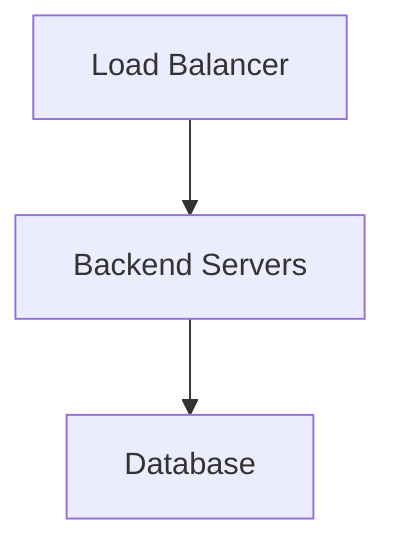
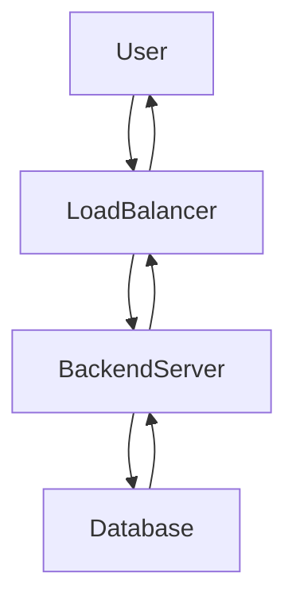

# Post Mortem: Software Crash Incident

**Author:** Lola Boye

## Issue Summary

- **Duration:** The outage occurred on September 05, 2024, from 10:00 AM to 2:00 PM (UTC+2).
- **Impact:** The software crash resulted in the unavailability of the company's main service, causing users to experience service disruptions and slow performance. Approximately 75% of the users were affected during this period.

## Timeline

- **Issue Detection:** The issue was detected at 10:00 AM through a monitoring alert triggered by a significant increase in error rates and response time.
- **Actions Taken:** The engineering team immediately investigated the system logs, database performance, and network connectivity. Initially, the assumption was that the issue might be related to a database failure or a network outage.
- **Misleading Investigation:** As part of the investigation, extensive time was spent analyzing the database logs and running diagnostics, which initially suggested a potential database performance issue.
- **Escalation:** After realizing that the initial investigation did not provide a clear resolution, the incident was escalated to the senior engineering team and the database administrators for further analysis and assistance.
- **Incident Resolution:** The incident was resolved by identifying a misconfiguration in the load balancer settings, which caused a bottleneck and resulted in the software crash. The load balancer was reconfigured to distribute the traffic evenly, and the system stability was restored by 2:00 PM.

## Root Cause and Resolution

- **Root Cause:** The root cause of the issue was traced back to a misconfigured load balancer, which led to uneven traffic distribution and ultimately caused the software crash.
- **Resolution:** The issue was fixed by reconfiguring the load balancer to evenly distribute the incoming requests among the available resources. This ensured proper load balancing and prevented the bottleneck that caused the software crash.

## Corrective and Preventative Measures

- **Improvements/Fixes:** The following areas can be improved to prevent similar incidents:
  1. Strengthen monitoring and alerting mechanisms to provide more timely notifications during abnormal system behavior.
  2. Implement regular load testing and performance profiling to identify potential bottlenecks and optimize system resources.
  3. Enhance documentation and configuration management processes to avoid misconfigurations.
- **Tasks to Address the Issue:**
  1. Conduct a comprehensive review of the load balancer configuration and ensure it aligns with best practices.
  2. Enhance monitoring alerts and thresholds to detect abnormal traffic patterns more effectively.
  3. Establish regular load testing procedures and incorporate them into the development and deployment lifecycle.
  4. Conduct a post-incident review with the engineering team to share key learnings and improve incident response processes.

